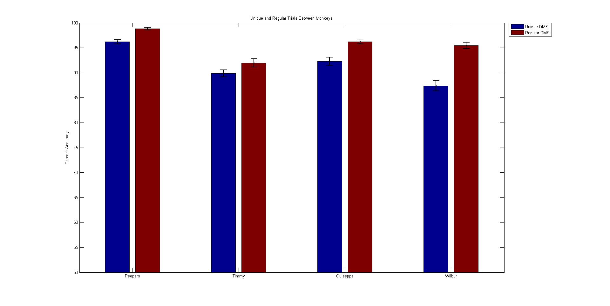
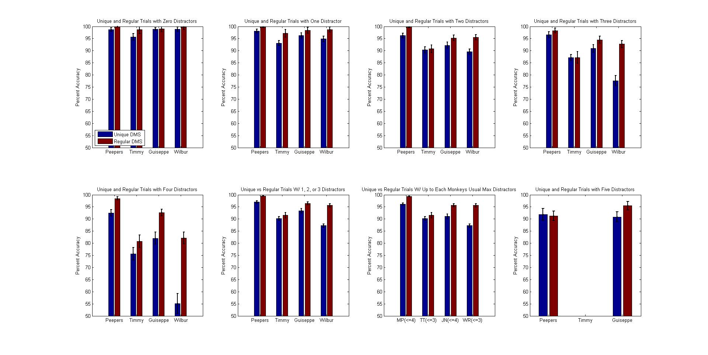
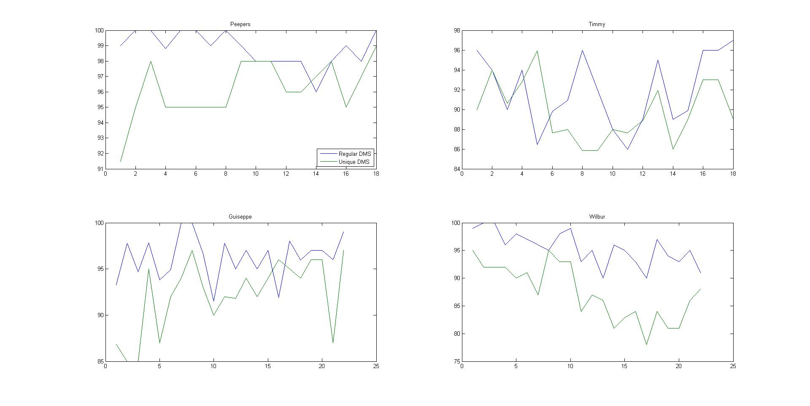
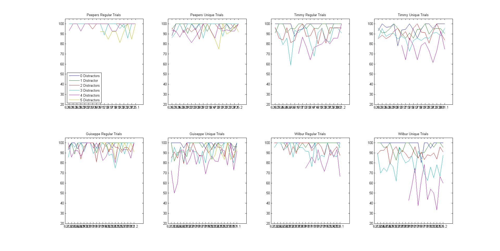

### Tasks [[Files](../../Behavioral Tasks/DMS)]
There are two variations of the [DMS task](../../Behavioral Tasks/DMS) being used in his experiment:  regular DMS and a [Trial-Unique DMS](../../Behavioral Tasks/DMS/Variations/Trial-Unique%20DMS) variation.  The meaningful difference between them is that the latter uses completely novel images for each trial, whereas regular DMS involves the same set of 6 images recycled each trial for the duration of the task.  The trial-unique DMS version was created to only run for 100 trials for each set (due to constraints on # of available stimuli).  So to account for this, we only looked at the behavioral performance of the first 100 trials of regular DMS for each day.

### Data [[Files](http://research.yerkes.emory.edu/Buffalo/Repository/Data/Trial-Unique-vs-Regular-DMS%20DATA.zip)]
The behavioral data files contained in the link above are all of the files that we deemed fit to use in our analysis.  Some sessions are excluded in the package for reasons that are pretty easy to figure out from the [behavioral logs in the Logs folder](Logs).  The most common reasons for exclusion were refusal on the part of the animal to participate for the duration of the task and thus producing extremely poor performance, and/or only one variation of DMS (regular or trial-unique) being run on a particular day (only days in which the animal was tested on both variations were included).  Also, the data for Timmy on June 25th was inexplicably lost.  If you wish to look at data that was excluded, simply look in the logs and look in the 'Cortex Data' folder on our network.  

### Analysis [[Files](Analysis)]
The main analysis file is [DMSPlotUniqueVsRegular.m](Analysis/DMSPlotUniqueVsRegular.m).  The only thing you have to do after downloading the data, is specify the path where you saved it in the first line of the analysis code:

    DataPath = 'S:\Aaron\analysis\data\'; % Specify the location of the data files!
    
The rest should run as-is and produce all of the regular figures and some extra.  We also created a function called [get_data_NoEOG](../../General Tools/Useful Functions/get_data/get_data_NoEOG.m) that should be added to the MATLAB search path.   It is the same as the usual [get_ALLdata](../../General Tools/Useful Functions/get_data/get_ALLdata.m), except that it doesn't pull in the EOG data.  This was done to make the script run more efficiently, and also to solve some memory problems with some of the data files.  The eye data is never used in any of this analysis, so it's unnecessary.

### Findings
The monkeys without a hippocampal lesion (Peepers, Giuseppe, Wilbur) all had a significant impairment in their performance on Trial-Unique DMS when compaired to their performance on regular DMS.  The hipocampally lesioned monkey (Timmy) did NOT have a significant difference in his performance on Trial-Unique and regular DMS at first, but then developed a very slight impairment over time and after we threw out a lot of data.  However, his performance on Regular DMS was already significantly lower than that of all the other monkeys.

Download the data and run the analysis script for more details and figures.  Here are how some of the main ones should look.

Total Performance:

Performance broken down by number of distractors:

Performance over time (days):

Peroformance over time (days) broken down by number of distractors:

### Future Development
* Increase the delay times.
* When we ran this first set of experiments, the The regular DMS image sets had all been seen by the monkeys in the past (albeit several months before).  Try it again with entirely new DMS image sets that are not in the usual daily DMS rotation.
* Run the experiment on more monkeys.  In this first run, we only had one monkey with a hippocampal lesion (Timmy), who had various confounding factors in his history that might affect our resulting comparisons (It also made it impossible to compare his own pre-lesion performance to his post-lesion performance.

